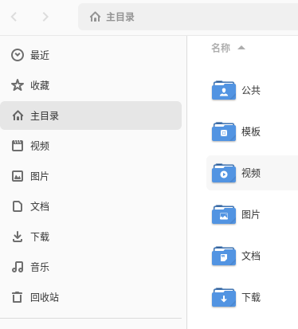
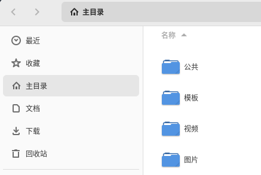

## Nautilus 的位置列表

作为 `GNOME` 默认的文件管理器，其左边提供了方便的 `位置`列表帮助用户快速找到目录。但是不是所有用户都希望显示那些选项。



然而 `Nautilus` 并没有提供修改它的选项。办法总比困难多，于是我去各大搜索引擎收集信息。

## XDG 用户目录环境变量

搜索一番才发现，`Nautilus` `位置` 列表显示的内容是根据 `XDG` 的环境变量而显示的。

`XDG` 用户目录环境变量的格式是：  `XDG_xxx_DIR` ，如：

```bash
XDG_DESKTOP_DIR="$HOME/桌面"
XDG_DOWNLOAD_DIR="$HOME/下载"
XDG_TEMPLATES_DIR="$HOME/模板"
XDG_PUBLICSHARE_DIR="$HOME/公共"
XDG_DOCUMENTS_DIR="$HOME/文档"
XDG_MUSIC_DIR="$HOME/音乐"
XDG_PICTURES_DIR="$HOME/图片"
XDG_VIDEOS_DIR="$HOME/视频"
```

当前用户的环境变量可以通过修改 `.bashrc` （如果你使用 `zsh` 应该修改 `.zshrc` 文件）或者 `~/.config/user-dirs.dirs` 文件改变。

修改后还需要使用下面的命令创建 `user-dirs` 文件：

```bash
echo "enabled=false" > ~/.config/user-dirs.conf
```

## 效果

我选择把 `~/.config/user-dirs.dirs` 文件修改成以下内容：

```bash
XDG_DESKTOP_DIR="$HOME/桌面"
XDG_DOWNLOAD_DIR="$HOME/下载"
#XDG_TEMPLATES_DIR="$HOME/模板"
#XDG_PUBLICSHARE_DIR="$HOME/公共"
XDG_DOCUMENTS_DIR="$HOME/文档"
#XDG_MUSIC_DIR="$HOME/音乐"
#XDG_PICTURES_DIR="$HOME/图片"
#XDG_VIDEOS_DIR="$HOME/视频"
```

然后需要通过以下 `3` 种方式让它生效：

1. 注销并重新登录
2. 重启系统
3. 使用 `nautilus -q` 命令强制退出所有 `Nautilus` 进程

最终你会发现，你注释掉的目录会在 `Nautilus` 的 `位置` 列表里消失了。



## 链接

https://forum.ubuntu.com.cn/viewtopic.php?t=460241
