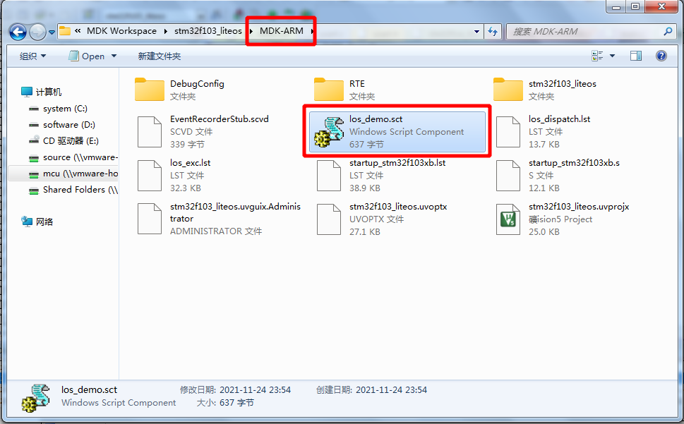

## 0x00 前言

​        本教程从零开始把 OpenHarmony 3.0 LiteOS-m 内核移植到 STM32F103 芯片上。开发工具是 MDK5。由于 LiteOS 官方已经适配过 Cortex-M 系列内核的单片机，因此移植过程非常简单。

​        LiteOS 有两种移植方案：接管中断和非接管中断方式。接管中断的方式，是由 LiteOS 创建很管理中断，需要修改 STM32 启动文件，移植比较复杂。STM32 的中断管理做的很好，用不着由 LiteOS 管理中断，所以我们下边的移植方案，都是非接管中断的方式的。中断的使用，跟在裸机工程时是一样的。

> 注：代码中的 `/* USER CODE BEGIN 0 */` 等类似的注释是 `STM32CubeMX` 生成的祼机工程里的代码，新增加的代码可以通过搜索这行注释找到修改的位置。

## 0x01工具

- STM32CubeMX - ST 官方免费工具，可以快速构建祼机工程
- MDK - 老牌 ARM 开发工具

## 0x02 构建祼机工程

​        打开 `STM32CubeMX` ，在主窗口中间的 `New Project` 下点击 `Start My Project from MCU`  下面的按钮。


​        在窗口左侧的 `Part Number` 处输入 `STM32F103C8` （我手上的开发板是 `STM32F103C8T6` 芯片，如果你使用的芯片是其他型号，这里输入你的芯片型号，如 `STM32F103CB`）。在右下方的列表中选择 `STM32F103C8` ，点击右上角的 `Start Project` 按钮。


### 02.01 打开串口调试


### 0x02.02 打开异步接收并启用全局中断


### 0x02.03 启用 DMA 功能


### 0x02.04 配置时钟

​        点击 `Clock Configuration` 直接在 `HCLK (MHz)` 下面输入 `64` 并按回车键，软件会自动更新其他参数。


### 0x02.05 生成代码

​        最后选上生成外设初始化文件并且修改工程信息，就可以点击右上角的 `GENERATE CODE` 按钮生成祼机工程的代码了。


​        如果是第一次生成祼机工程，`STM32CubeMX` 会先下载一些组件，耐心等待就好了。生成成功后点击 `Open Project` 直接打开工程。


## 0x03 修改祼机工程

​        `STM32CubeMX` 重成的原始代码已经可以正常编译并运行，我们稍微修改一下以方便我们移植。

### 0x03.01 实现串口空闲中断接收

​        打开 `usart.h` 文件，在 `USER CODE BEGIN Prototypes` 与 `USER CODE END Prototypes` 之间插入以下代码：

```C
/* USER CODE BEGIN Prototypes */

#define UART1_BUFF_SIZE   256 //串口接收缓存区长度
typedef struct  
{  
  uint8_t  RxFlag;            //空闲接收标记  
  uint16_t RxLen;             //接收长度  
  uint8_t  *RxBuff;           //DMA接收缓存  
} USART_RECEIVETYPE;  

extern USART_RECEIVETYPE Uart1Rx;

void USART1_ReceiveIDLE(void);

void UART_SendData(USART_TypeDef *uart, uint8_t *buff, uint16_t size);

/* USER CODE END Prototypes */
```

​        打开 `usart.c` 文件，在 `USER CODE BEGIN 1` 与 `USER CODE END 1` 之间插入以下代码：

```C
/* USER CODE BEGIN 1 */

// 实现串口空闲中断接收开始
static uint8_t Uar1tRxBuff[UART1_BUFF_SIZE+1]; //定义串口接收buffer

USART_RECEIVETYPE Uart1Rx = {
  .RxBuff = Uar1tRxBuff,
};
 
void USART1_ReceiveIDLE(void)  
{  
  uint32_t temp;  
  if((__HAL_UART_GET_FLAG(&huart1, UART_FLAG_IDLE) != RESET))  
  {
    __HAL_UART_CLEAR_FLAG(&huart1, UART_FLAG_IDLE); 

    temp = huart1.Instance->SR;
    temp = huart1.Instance->DR;

    HAL_UART_DMAStop(&huart1);  

    temp = huart1.hdmarx->Instance->CNDTR;  

    Uart1Rx.RxLen  = UART1_BUFF_SIZE - temp;   
    Uart1Rx.RxFlag = 1; 
    Uart1Rx.RxBuff[Uart1Rx.RxLen] = 0;
    HAL_UART_Receive_DMA(&huart1, Uart1Rx.RxBuff, UART1_BUFF_SIZE);  
  } 
}
// 实现串口空闲中断接收结束

/* USER CODE END 1 */
```

### 0x03.02 重定向 `printf` 和 `scanf` 函数

​        打开 `usart.c` 文件，在 `USER CODE END 1` 上面插入以下代码：

```C
// 实现串口空闲中断接收结束

// 重定向 printf 和 scanf 函数开始
void UART_SendByte(USART_TypeDef *uart, uint8_t data)
{     
  uart->DR = data;
  while((uart->SR & UART_FLAG_TXE) == 0);
  while((uart->SR & UART_FLAG_TC) == 0);       
}

void UART_SendData(USART_TypeDef *uart, uint8_t *buff, uint16_t size)
{
  while(size--)
  {
    uart->DR = *(buff++);
    while((uart->SR&UART_FLAG_TXE)==0);
  }

  while((uart->SR&UART_FLAG_TC)==0);       
}

#include <stdio.h>

// 重定向 c 库函数 printf 到 USART1
int fputc(int ch, FILE *f)
{
  /* 发送一个字节数据到 USART1 */
  UART_SendByte(USART1, (uint8_t) ch);
  return (ch);
}
 
// 重定向 c 库函数 scanf 到 USART1
int fgetc(FILE *f)
{
  /* 等待串口1输入数据 */
  while((USART1->SR & UART_FLAG_RXNE) == 0);
  return (int)USART1->DR & 0xff;
}
// 重定向 printf 和 scanf 函数结束

/* USER CODE END 1 */
```

### 0x03.03 打开 DMA 接收
修改 `usart.c` 文件中的 `MX_USART1_UART_Init` 函数，在 `USER CODE BEGIN USART1_Init 2` 与 `USER CODE END USART1_Init 2` 之间插入以下代码：

```C
  /* USER CODE BEGIN USART1_Init 2 */

  __HAL_UART_CLEAR_FLAG(&huart1, UART_FLAG_IDLE); 
  __HAL_UART_CLEAR_FLAG(&huart1, UART_FLAG_TC); 
  HAL_UART_Receive_DMA(&huart1, Uart1Rx.RxBuff, UART1_BUFF_SIZE); //开启DMA接收 
  __HAL_UART_ENABLE_IT(&huart1, UART_IT_IDLE);                    //使能空闲中断

  /* USER CODE END USART1_Init 2 */
```

​        在 `stm32f1xx_it.c` 文件中声明 `USART1_ReceiveIDLE` 函数，并在串口中断函数 `USART1_IRQHandler` 中调用该函数：

```C
/* USER CODE BEGIN 0 */

// 声明函数
void USART1_ReceiveIDLE(void);

/* USER CODE END 0 */
```

```C
  /* USER CODE BEGIN USART1_IRQn 0 */

  // 调用函数
  USART1_ReceiveIDLE();

  /* USER CODE END USART1_IRQn 0 */
```

### 0x03.04 在 `main.c` 文件里的 `main` 函数中添加代码，验证裸机工程

```C
    /* USER CODE BEGIN 3 */
      HAL_Delay(500);
      printf("This is output by printf!\r\n");
      if(Uart1Rx.RxFlag){
          Uart1Rx.RxFlag = 0;
          UART_SendData(USART1,Uart1Rx.RxBuff,Uart1Rx.RxLen);
      }
```

​        编译下载程序，就可以看到 串口在不停的打印 `This is output by printf!` 了。

## 0x04 使用 MDK 的模拟器

​        当然，我们也可以使用 `MDK` 的模拟器运行并调试我们的代码。点击 `Project->Options...` 菜单，并修改以下参数：


​     点击 `OK` 关闭对话框，然后点击下面的按钮启动调试：


​        如果点击了第三个按钮之后它还没有变灰色，就需要多按两次。代码运行后就可以在 `UART #1` 窗口看到串口输出的内容了。

​        至此祼机工程已经创建成功并且验证完毕。

## 0x05 添加 LiteOS-m 内核代码

​        在前面，我们已经创建好祼机工程并验证成功。现在我们可以往祼机工程里添加 `LiteOS-m` 的代码进行移植工作了。

### 0x05.01 下载 `LiteOS-m` 代码

​        打开 https://gitee.com/openharmony/kernel_liteos_m 进入 `LiteOS-m` 代码托管网站。在左边的分支下拉框选择 `OpenHarmony-3.0-LTS` （我们进行移植的是 3.0 版本，目前在网上找到的教程都是基于 1.0 版本进行移植的，1.0 版本比较老旧，而且有还有部分代码没有开源），点击右边的 `克隆/下载` ，再点击 `下载ZIP` 。


​        把下载到的 `zip` 压缩包解压到工程目录的 `Core\LiteOS` 目录下：


### 05.02 下载 C++ 公共基础库

​        打开 https://gitee.com/openharmony/utils_native 进入  C++ 公共基础库代码托管网站。在左边的分支下拉框选择 `OpenHarmony-3.0-LTS` ，点击右边的 `克隆/下载` ，再点击 `下载ZIP` 。

​        把下载到的 `zip` 压缩包解压到工程目录的 `Core\utils_native` 目录下：


### 0x05.03 添加代码到 `MDK` 工程

​        回到 `MDK` 点击 `Project->Manage->Project Items...` 菜单，把以下代码添加到 `MDK` 工程：

```
Core\LiteOS\kernel\arch\arm\cortex-m3\keil\
	*.c
	los_dispatch.S
	los_exc.S
```


```
Core\LiteOS\kernel\src
	*.c
Core\LiteOS\kernel\src\mm
	*.c
```


```
Core\LiteOS\components\power
	*.c
Core\LiteOS\components\exchook
	*.c
```


```
Core\utils_native\base\src
	memcpy_s.c
	memset_S.C
	strcpy_s.c
	strncpy_s.c
```


```
Core\LiteOS\utils
	los_debug.c
	los_error.c
```


### 0x05.04 下载 `target_config.h`

​        把 https://gitee.com/rtos_lover/stm32f103_simulator_keil/raw/master/target_config.h 文件保存到 `Core\target_config` 目录。

​        并在 `Core\target_config` 目录新建一个空的 `ARMCM3.h` 文件。


### 0x05.05 添加包含目录

​        点击 `Project->Options...` 菜单，切换到 `C/C++` 标签。


​        把以下目录添加到列表里：

```
..\Core\LiteOS\kernel\arch\arm\cortex-m3\keil
..\Core\LiteOS\kernel\arch\include
..\Core\LiteOS\kernel\include
..\Core\LiteOS\utils
..\Core\LiteOS\utils\internal
..\Core\LiteOS\components\power
..\Core\LiteOS\components\exchook
..\Core\utils_native\base\include
..\Core\target_config
```


### 05.06 修改 `target_config.h`

​        在打开 `target_config.h` 文件，在 `#include "ARMCM3.h"` 下面添加 `#include "stm32f1xx.h"` 。

```C
#include "ARMCM3.h"

#include "stm32f1xx.h"  // 增加此行代码

#ifdef __cplusplus
```

​       搜索 `g_memStart` 并注释掉以下 4 行代码：

```
/*=============================================================================
                                       Memory module configuration
=============================================================================*/
/* 注释下面 4 行代码
extern unsigned char g_memStart[];
#define LOSCFG_SYS_EXTERNAL_HEAP                            1
#define LOSCFG_SYS_HEAP_ADDR                                (&g_memStart[0])
#define LOSCFG_SYS_HEAP_SIZE                                0x00013000
*/
#define LOSCFG_MEM_MUL_POOL                                 1
#define OS_SYS_MEM_NUM                                      20
```

​       保存文件后按 `F7` 或点击 `Project->Build Target` 菜单，如果你没有操作错误，应该可以编译通过了。


## 0x06 完成 `LiteOS-m` 移植

​        前面我们已经把 `LiteOS-m` 内核的代码和相关依赖的代码都添加到工程里面并编译通过，移植工作已经完成过半了。最后只剩下初始化和启动 `LiteOS` 系统了。

​        祼机工程最后会进入到 `main.c` 文件的 `main` 函数，因此我们需要在 `main` 函数来初始化并启动 `LiteOS-m` 内核。

### 0x06.01 在 `main.c` 引入头文件

```C
/* USER CODE BEGIN Includes */

#include <stdio.h>
#include "los_task.h"

/* USER CODE END Includes */
```

### 0x06.02 添加任务函数

```C
/* USER CODE BEGIN 0 */

static void Task1(void)
{
  while(1) {
    printf("Running Task1...\r\n");
    LOS_TaskDelay(1000);
  }
}

static void Task2(void)
{
  while(1) {
    printf("Running Task2...\r\n");
    LOS_TaskDelay(3000);
  }
}

UINT32 RX_Task_Handle;
UINT32 TX_Task_Handle;

static UINT32 AppTaskCreate(void)
{
  UINT32 uwRet = LOS_OK;
	
  TSK_INIT_PARAM_S task_init_param;	

	task_init_param.usTaskPrio = 6;
	task_init_param.pcName = "Task1";
	task_init_param.pfnTaskEntry = (TSK_ENTRY_FUNC)Task1;
	task_init_param.uwStackSize = 2048;	
	uwRet = LOS_TaskCreate(&RX_Task_Handle, &task_init_param);
  if (uwRet != LOS_OK)
  {
    printf("Task1 create failed, %X\n", uwRet);
    return uwRet;
  }
    
  task_init_param.usTaskPrio = 4;	
	task_init_param.pcName = "Task2";
	task_init_param.pfnTaskEntry = (TSK_ENTRY_FUNC)Task2;
	task_init_param.uwStackSize = 2048;
	uwRet = LOS_TaskCreate(&TX_Task_Handle, &task_init_param);
  if (uwRet != LOS_OK)
  {
    printf("Task2 create failed, %X\n", uwRet);
    return uwRet;
  } 

	return LOS_OK;
}

/* USER CODE END 0 */
```

### 0x06.03 在 `main` 函数初始化并启动 `LiteOS-m` 内核

```C
  /* USER CODE BEGIN 2 */

  LOS_KernelInit(); // 初始化 LiteOS-m 内核
  UINT32 uwRet = AppTaskCreate(); // 创建任务
  if(uwRet != LOS_OK) {
      printf("LOS Creat task failed\r\n");
  }
  LOS_Start();      // 启动 LiteOS-m 内核
	
  /* USER CODE END 2 */
```

### 0x06.04 使用分散加载

​        上面修改后的代码已经可以编译通过，但是你会发现最后链接的时候会报以下错误：

> stm32f103_liteos\stm32f103_liteos.axf: Error: L6406E: No space in execution regions with .ANY selector matching los_memory.o(.bss). 
>
> ...

​        那是因为 `LiteOS` 的代码已经超出祼机工程默认的链接配置了，我们需要使用自定义的链接脚本。

​        把 https://gitee.com/rtos_lover/stm32f103_simulator_keil/raw/master/project/los_demo.sct 文件保存到 `MDK-ARM` 目录。



​        打开 `los_demo.sct` 修改成以下内容：

```
; *************************************************************
; *** Scatter-Loading Description File generated by uVision ***
; *************************************************************

LR_IROM1 0x08000000 0x00200000  {    ; load region size_region
  ER_IROM1 0x08000000 0x00200000  {  ; load address = execution address
   *.o (RESET, +First)               ; 修改这行
   *(InRoot$$Sections)
   * (+RO)
  }
  RW_IRAM1 0x20000000 0x00200000  {  ; RW data
      * (.data, .bss, .data.init)
	  * (+RW +ZI)                    ; 增加这行
  }
    VECTOR 0x20200000 0x400         ; Vector
  {
	* (.vector)
  }
  
  ARM_LIB_STACKHEAP 0x08100000 EMPTY 0x1000 
  {
	
  }	
}
```

​        最后配置 `MDK` 使用 `los_demo.sct` 链接就可以了。点击 `Project->Options...` 菜单，切换到 `Linker` 标签，按下面的图片修改设置：


​        编译并启动模拟器后可以看到 `LiteOS` 已经可以正常运行了。


## 0x07 代码下载

​        完整的代码可以点击 [stm32f103_liteos.7z](stm32f103_liteos.7z) 下载。

## 0x08 链接

https://blog.51cto.com/u_15214399/2809850

https://gitee.com/openharmony/kernel_liteos_m

https://gitee.com/openharmony/utils_native

https://gitee.com/rtos_lover/stm32f103_simulator_keil

https://www.st.com/zh/development-tools/stm32cubemx.html

https://www.keil.com/mdk5
