## 0x00 起因

 　　最近在咸鱼入手了一台 `FC3000` ，打算刷 [司徒做的开源系统](https://github.com/steward-fu/fc3000) 。烧写好 SD 卡之后开机一直黑屏无法成功进入系统。

　　后来找到了司徒的开源帖：[研究FC3000掌機的開源可行性 / 司徒开源 / WhyCan Forum(哇酷开发者社区)](https://whycan.com/t_6647.html) 。

　　在司徒的开源帖上爬楼并联系司徒后得知：司徒移植时的机器是 TN 屏，我手上的是 IPS 屏。由于屏幕不是同一型号，因此它们的初始化资料也不同。

　　最终在司徒的帮助得指导下，成功点亮我手上的机器。

## 0x01 什么是数字逻辑分析仪

　　逻辑分析仪(Digit Logic Analyzer)是分析数字系统逻辑关系的仪器。逻辑分析仪是属于数据域测试仪器中的一种总线分析仪，即以总线（多线）概念为基础，同时对多条数据线上的数据流进行观察和测试的仪器，这种仪器对复杂的数字系统的测试和分析十分有效。

## 0x02 数字逻辑分析仪有什么作用

　　逻辑分析仪是数字设计验证与调试过程中公认最出色的工具，它能够检验数字电路是否正常工作，并帮助用户查找并排除故障。逻辑分析仪的主要特点是能够同时观察多个信号；能够按高低电平、升降沿等模式触发多条信号线，并查看结果。

　　由于我手上并没有数字逻辑分析仪，于是去某宝淘了一个 24M 采样率 8 通道的开源产品：

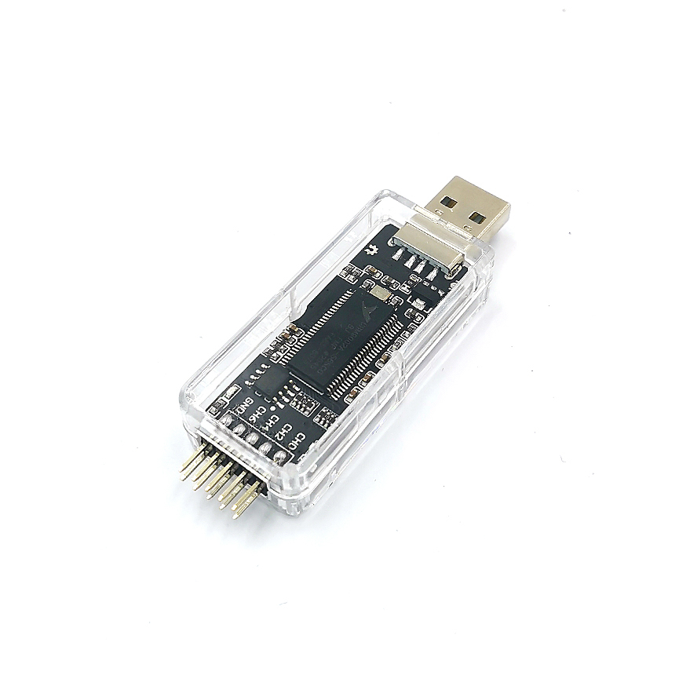 

## 0x04 实验条件

1. 电脑

2. `PulseView` 和 `VIM` 、`WPS 表格`或 `Excel`

3. 数字逻辑分析仪

4. 被分析的数字电路

5. 确定需要分析的引脚作用

## 0x04 实验任务

　　通过逻辑分析找出我手上的 `FC3000` 的屏幕初始化资料，并点亮我手上的屏幕。

## 0x05 确定引脚的作用

我需要点亮的就是以下这款机器：

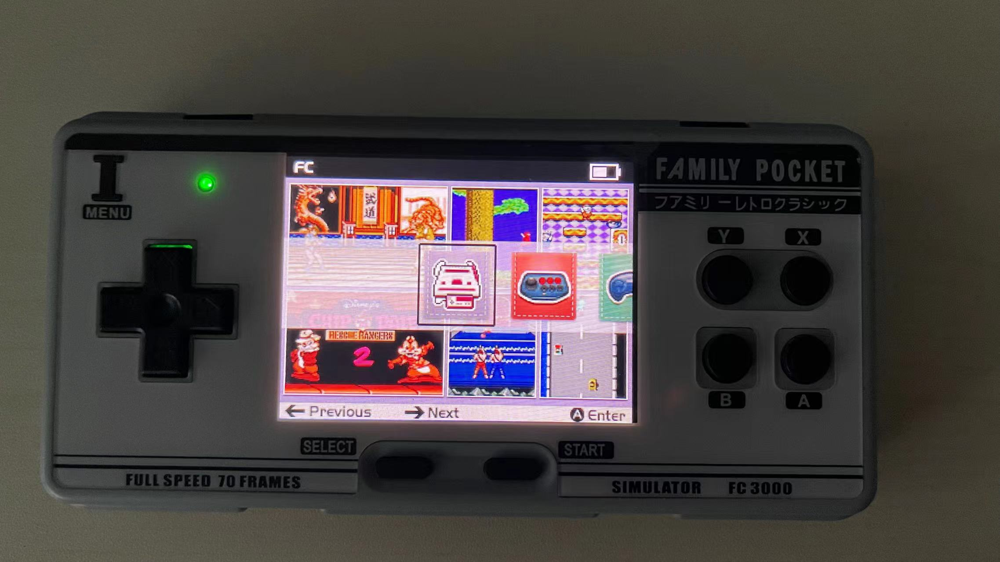

　　这是它的屏，网上没有找到它的资料。

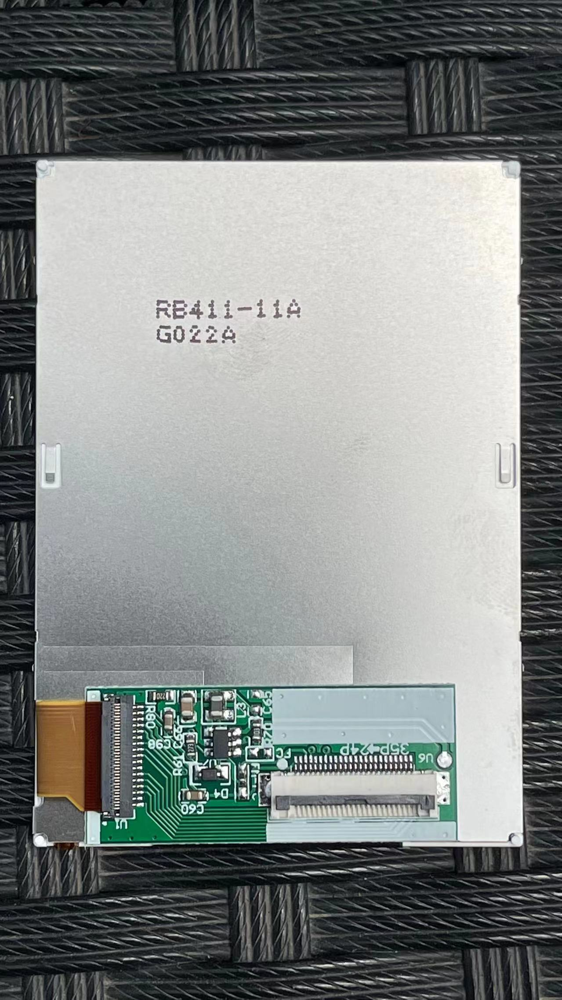

　　这个地址 https://steward-fu.github.io/website/handheld/fc3000/lcd_init.htm 有司徒找出 LCD 的初始化資料和经过和结果。

　　我重新测量了我手上的机器，确定引脚的作用的司徒给出的列表是一致的。

## 0x06 连接逻辑分析仪

　　由于屏幕需要测量的引脚是 18 个（`RS` + `WR` + `DB[0-15]`），而我手上的逻辑分析仪只有 8 通道，因此我必须分 3 次测量。

　　这个是我的测量方法：

1. `RS`、`WR` 必须测量，因为需要通过这 2 个引脚确定什么时候开始写，以及写入的是命令还是数据。

2. 第一次测量 `DB0~DB5` 。

3. 第二次测量 `DB5~DB10` 。

4. 第三次测量 `DB10~DB15` 。

5. 每次测量分别进行 3 次采样，以排除杂乱的信号。

　　我把逻辑分析仪 `CH0-CH5` 通道用于连接屏幕的 `DB0~DB15` 引脚，`CH7` 通道固定的 `RS` 引脚，`CH8` 通道固定为 `WR` 引脚。

　　下图是连接好的 `DB10~DB15` 以及 `RS` 、`WR` 引脚，逻辑分析仪的 `GND` 连接到目标电路的 `GND` ：

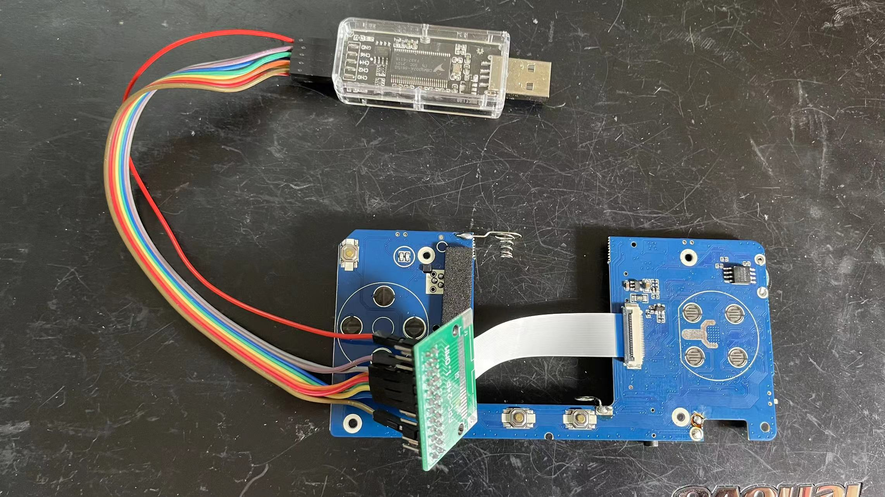

## 0x07 设置 PulseView

> 注：`PulseView` 的安装和逻辑分析仪驱动的安装不在本文的范围内，你可以咨询卖家或网上搜索相关教程。

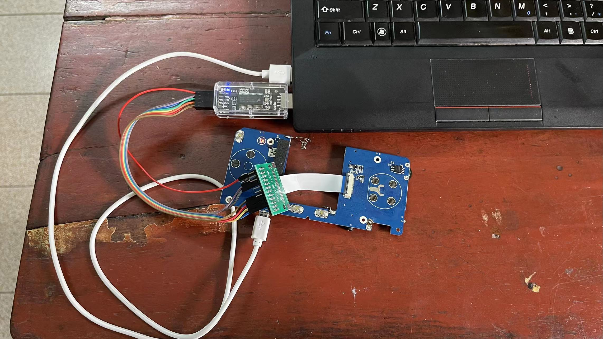

　　逻辑分析仪连接到电脑，打开 `PulseView` ，默认选择的是 `Demo device`。点击右边的小三角选择 `Connect to Device...` 。

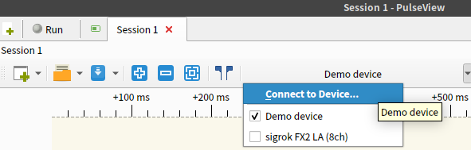

　　在弹出的对话框中选择驱动、扫描设备并选择你的逻辑分析仪。

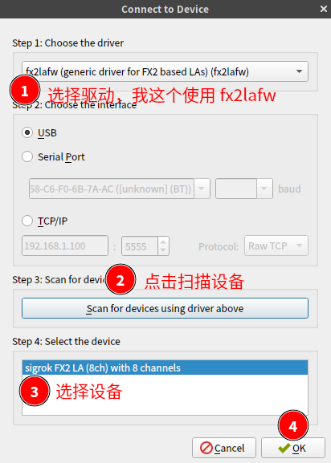

　　最后设置采样数和采样率并修改一下通道名称。

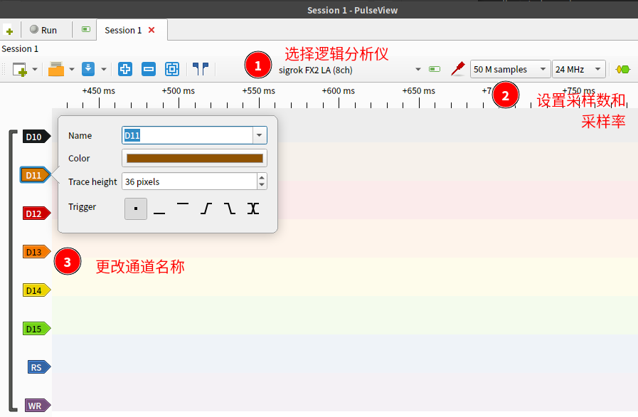

　　由于我并不知道需要分析的屏幕工作在多少的频率下，因此我选择了逻辑分析仪最大采样率 `24M` 。

> 注：逻辑分析采样率最低要目标频率 2 倍以上，建议 5 到 10 倍。

　　屏幕的初始化会在机器上电后一秒内完成。所以我选择采样 `50M` 采样数，大约采样两秒时间。

　　鼠标放上去会显示采样时长：

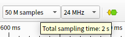

## 0x08 开始采样

　　此次实验需要进行 3 次测量，每次测量采样 3 次。我把第 1 次测量采集到的数据分别保存成 `1-1.csv` ~ `1-3.csv` ，第 2 次测量采集到的数据分别保存成 `2-1.csv` ~ `2-3.csv` ，第 3 次类推。

　　点击 `PulseView` 左上角的 `Run` 按钮，并给目标电路上电。

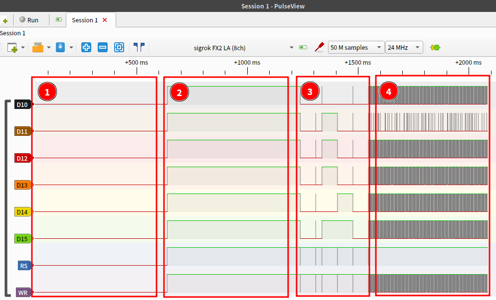

　　我暂时把它分为四个阶段：

1. 目标电路未上电

2. 目标电路上电

3. 初始化屏幕

4. 正常刷新屏幕

　　先把它导出成 csv 文件等等后续分析。点击保存按钮右边的小三角，选择 `Export Comma-separated values...` 菜单，并选择保存路径。

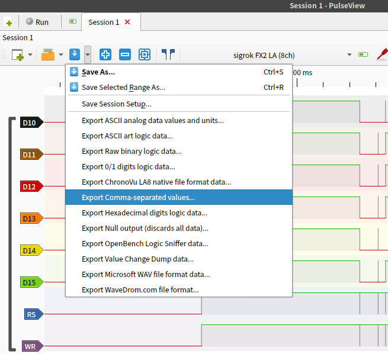

　　导出参数把 `Label values` 改成 `channel` ，这样会使用我们设置好的通道名称标识数据，方便后细分析。

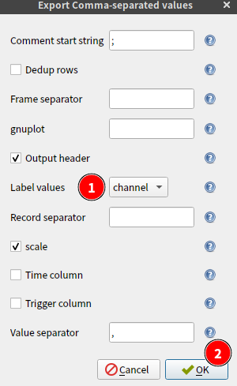

　　导出完成后再次点击 `Run` 按钮进行第 2 次采样和第 3 次采样。

　　`DB10~DB15` 采集完 3 次后。调整分析仪 `CH0~CH5` 连接 `DB0~DB5` 和 `DB5~DB10` 重复上面的采样工作。

　　最终得到以下 9 个文件：

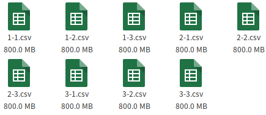

　　文件头带有我们设置好的通道名称：

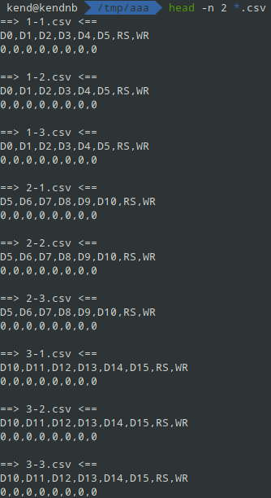

## 0x09 采样失败的处理

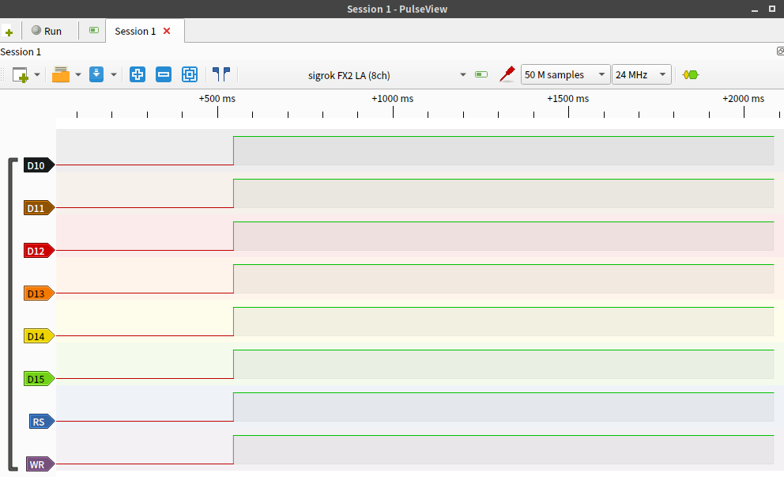

　　有时候会采样失败，如上图所示，一直只有高电平信号。

　　还有点击 `Run` 按钮之后没有开始采样。

　　点击 `Run` 按钮后 `PulseView` 卡死。

　　出现以上情况，取下分析仪重新连接电脑并重启 `PulseView` 一般可以解决。

## 0x10 去除重复的数据

　　我们设置的采样率大于目标电路的频率，同一个信号会采集多次。我们分析的时候只保留一份数据就可以了。

　　我们需要先处理一下，把重复的数据去掉。

```bash
awk -F ' ' 'BEGIN { last=""; } { if (last != $1) { last = $1; print $1 } }' 1-1.csv > dedup1-1.csv
awk -F ' ' 'BEGIN { last=""; } { if (last != $1) { last = $1; print $1 } }' 1-2.csv > dedup1-2.csv
awk -F ' ' 'BEGIN { last=""; } { if (last != $1) { last = $1; print $1 } }' 1-3.csv > dedup1-3.csv
awk -F ' ' 'BEGIN { last=""; } { if (last != $1) { last = $1; print $1 } }' 2-1.csv > dedup2-1.csv
awk -F ' ' 'BEGIN { last=""; } { if (last != $1) { last = $1; print $1 } }' 2-2.csv > dedup2-2.csv
awk -F ' ' 'BEGIN { last=""; } { if (last != $1) { last = $1; print $1 } }' 2-3.csv > dedup2-3.csv
awk -F ' ' 'BEGIN { last=""; } { if (last != $1) { last = $1; print $1 } }' 3-1.csv > dedup3-1.csv
awk -F ' ' 'BEGIN { last=""; } { if (last != $1) { last = $1; print $1 } }' 3-2.csv > dedup3-2.csv
awk -F ' ' 'BEGIN { last=""; } { if (last != $1) { last = $1; print $1 } }' 3-3.csv > dedup3-3.csv
```

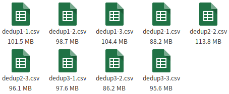

## 0x11 去除屏幕刷新数据

　　我们的目标是提取屏幕初始化的资料，后面刷新屏幕的数据对于我们这次的目标来说没有作用，把它去除以减少我们处理的数据大小。

　　我们知道 `RS` 引脚电平是 0 的时候代表写入的是命令，电平是 1 的时候代表写入的是数据。而只有初始化屏幕的时候才需要写入命令，后面刷新屏幕的时候只写入数据。

　　所以，我们可以找 `RS` 信号为 0 的最后一个信号，确定屏幕初始化结束的位置。

　　使用 `VIM` 打开这些 `csv` 文件。

```bash
vim *.csv
```

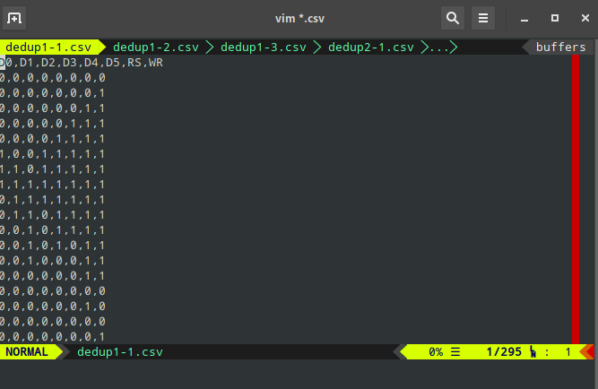

> 注：你看到的 vim 界面很可能和我的不一样，因为我的 vim 安装了很多插件。如果你觉得一次性编辑所有文件有困难，你可以选择一次只编辑一个文件。

　　原生 vim 打开后很可能是这样的界面：

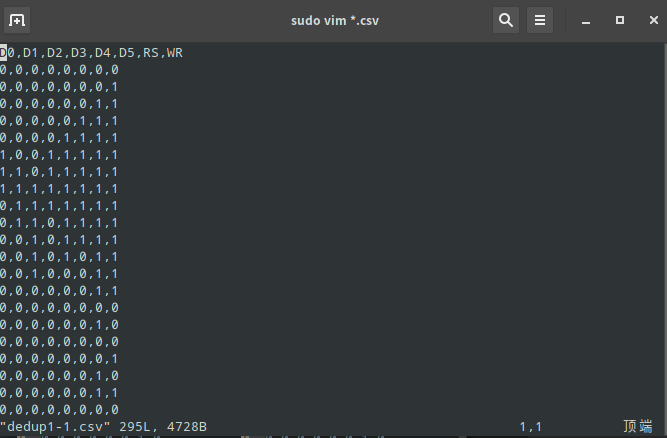

> 在 vim 输入命令 `?0,.$` + `Enter` 键，查找最后一个 `RS` 为 0 的信号。

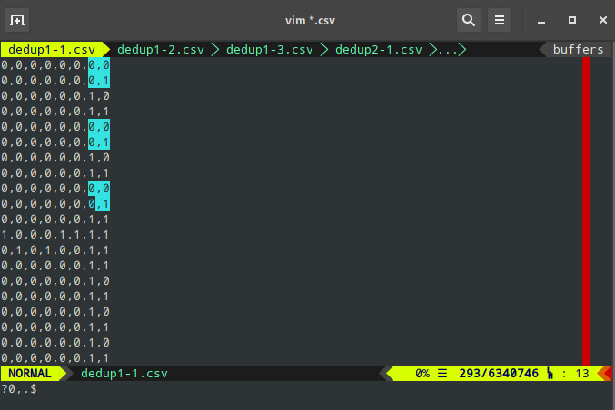

> 再次在 vim 输入 `3jdG` 命令，删除后面的屏幕刷新信号。

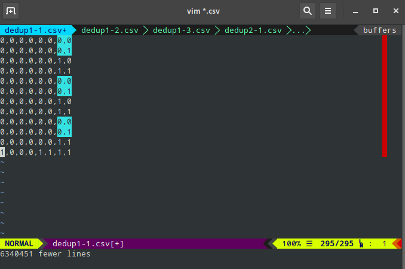

> 输入 `:bn` + `Enter` 键切换下一个文件，并重复上面的修改步骤。

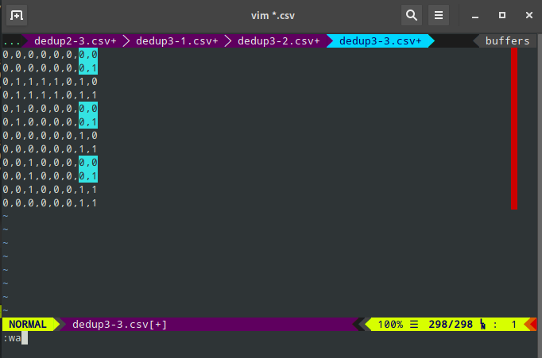

> 输入 `:wa` + `Enter` 键保存所有文件。再输入 `:qa` + `Enter` 键退出 vim 。
> 
> 当然，你也可以把两个命令组合成 `:wqa` + `Enter` 保存所有文件并退出。

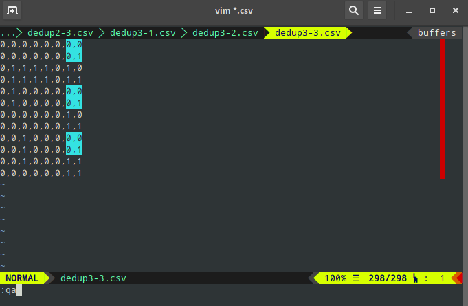

　　去除刷新屏幕的信号之后的文件已经非常小了。

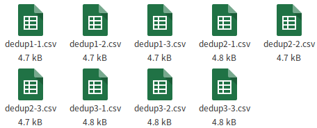

## 0x12 清除杂乱的信号

　　输入下面的命令打开测量 `DB0~DB5` 的 3 次采样数据。

```bash
vimdiff dedup1*
```

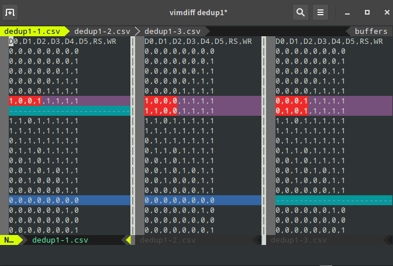

　　先分析一下这一个界面的信号数据。

　　我们回顾一下 `RS` 引脚和 `WR` 引脚的作用：

* `RS` 电平为 0 时代表写入的是命令；电平为 1 时代表写入的是数据。

* `WR` 电平为 0 时代表读取数据；电平为 1 时代表写入数据。

　　我们的任务是要找到初始化屏幕的资料，因此 `WR` 为 0 的电平对我们这次的任务来说是没有意义的。这样首先排除了第一行信号和倒数 2~4 行的信号。

　　再看中间的 `WR` 为 1 的连续信号，连续写入的数据显然也是无效数据，这些很可能是 `MCU` 初始化引脚时输出的信号。那么只剩下最后一行有效信号。

　　使用你心爱的文本编辑器打开这 3 个文件，把前面的这些被排除的信号删除。注意保留第一行的 D0 ，这行是引脚的标识。

　　再回到 vim 界面时会自动重新读取文件，现在界面看起来大概是下面这图的样子。

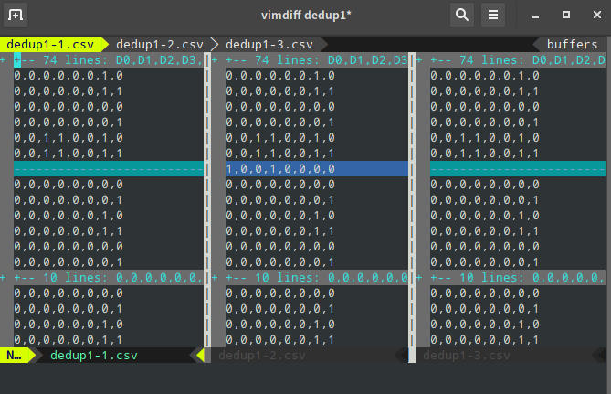

> 注：以 "+ +--" 开头的行表示这里有多少行相同的数据，如第一行的 "+ +-- 74 lines" 代表这里有 74 行相同的数据。

　　按 `PageUp` 和 `PageDown` 键浏览一下现在的文件，你会发现只有少数几行不一样。我们把不相同的行当作杂乱的信号删除掉。

> 使用 `Ctrl-W + Ctrl-W` 热键切换文件，`j` 和 `k` 把光标移动到不相同的行，再按 `dd` 删除此行。

　　你也可以选择使用其他 3 文件合并工具，如 `Beyond Compare` 对比 3 个文件。但记得要以文本方式比较。

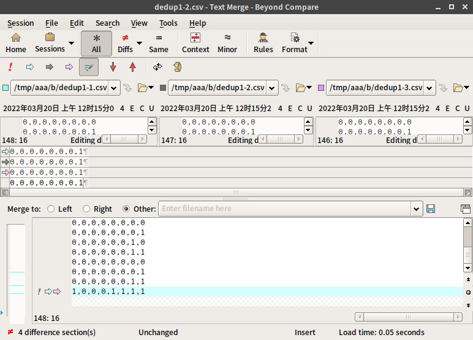

　　把不相同的行全部删除就好了。

　　使用相同的方法处理 `dedup2*.csv` 和 `dedup3*.csv` 。

　　现在，我们得到的文件看起来像这样的：

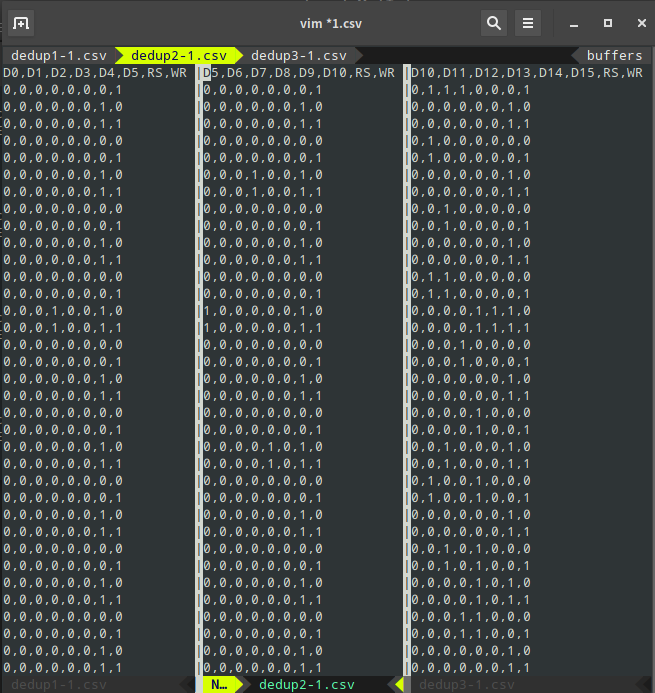

> 注：经常上面的处理，每次测量的三个采样文件已经完全相同。所以后面只需要处理其中一个就可以了。我这里选择处理 `1-1.csv` 、`2-1.csv` 和 `3-1.csv` 。

　　可以看到，上面还有 `WR` 为 0 时的信号，对我们这次的实验是无效数据，应该删除。

> 在 vim 输入 `:g/0$/d` + `Enter` 键删除所有以 0 结尾的行。
> 
> 继续输入 `:bn` 切换文件处理另外 2 个文件。
> 
> 最后 `:wqa` 保存并退出 vim 。

　　剩下的就是目前我们认为是有效的数据了：

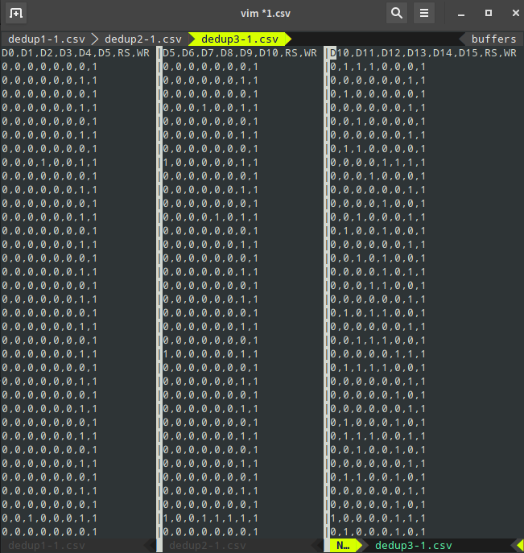

　　仔细看一下我们得到的数据：

* `WR` 全部为 1 ，都是写入的信号。

* `RS` 一行为 0 ，一行为 1 ，代表写一行命令再写一行数据。

　　这样的特征完全符合屏幕初始化的流程。

## 0x13 组合信号

　　细心的小伙伴可能会发现，3 次测量的引脚有重复的引脚。分别是第 1 次和第 2 次重复了 `DB5` ，第 2 次和第 3 次重复了 `DB10` 。

　　可能你会觉得没必要重复测量同一个引脚，理论上确实是没必要。只是从一开始我就有一个小心思，可以利用这个重复的引脚校对和定位。

　　具体怎么操作呢？

1. 校对 - 因为屏幕初始化的数据是固定的，所以无论你测量多少次，都应该是一样的。
   
   > 现在我们可以利用 `DB5` 校对第 1 次测量和第 2 次测量有没有问题，`DB10` 校对第 2 次测量和第 3 次测量有没有问题。

2. 定位 - 因为采样会采集到杂乱信号，就像前面我们处理那些。如果得到的相同的数据在不同的行说明还有杂乱信号导致移位了。

　　校对后把 `dedup1-1.csv` 、`dedup2-1.csv` 、`dedup3-1.csv` 三个文件按行合并成最终的信号。

　　你可以使用 `WPS` 、`Excel` 等电子表格类的软件进行合并，也可以使用 `vim` 等支持列模式的编辑软件编辑。

　　为方便截图和说明，我这里使用 `WPS` 进行处理。

　　使用 `WPS` 打开这 3 个文件，把 `dedup2-1.csv` 、`dedup3-1.csv` 两个文件的内容分别复制到 `dedup2-1.csv` 文件的右边。

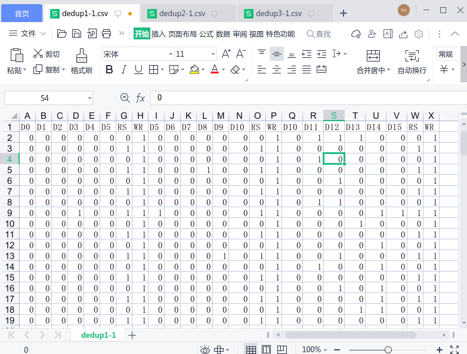

　　在 `Y2` 格子输入公式 `=F2=I2` + `Enter` ，然后双击该格子右下角的粗点。校对发现第 9 行两个 D5 的数据不一致了，

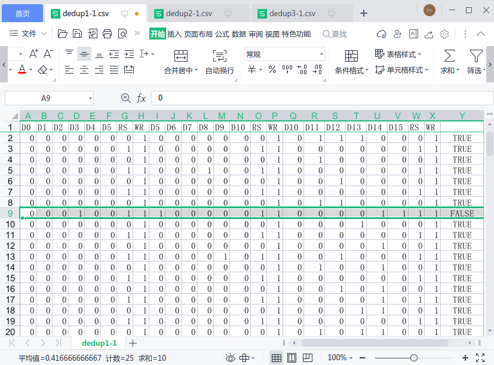

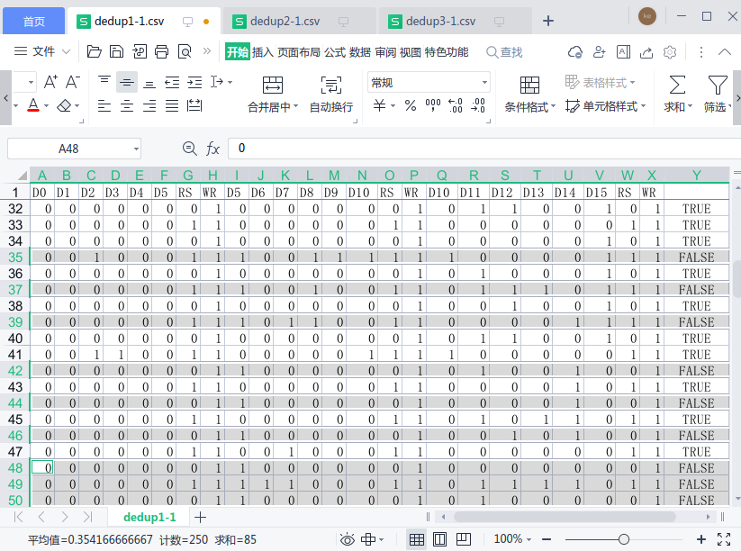

　　后面也有大量不一致的行，因此可以判断 `D0~D5` 或 `D5~D10` 的采样出问题了。

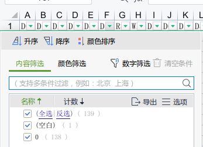

　　看了一下 `D0~D5` 采样的的 `D5` 数据，全是 0 ，可以判定是 `D0~D5` 的采样出问题，必须重新进行此采样。

　　我重新采样后 2 次采样的 `D5` 以及 `D10` 都是完全对。

　　最后把中间多余的 `RS~D5` 列，以及 `RS~D10` 列删除。

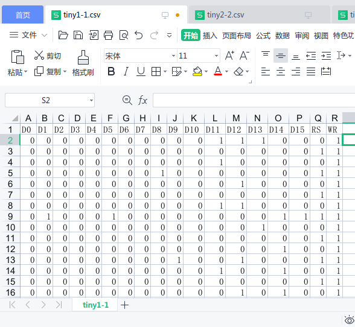

　　在 `S` 列输入以下公式，再双击此列右下角的粗点，这一列的计算结果就是最终的初始化数据了。配合 `RS` 列可知道写入的是数据还是指令。

```
=DEC2HEX(BITLSHIFT(A2,0)+BITLSHIFT(B2,1)+BITLSHIFT(C2,2)+BITLSHIFT(D2,3)+BITLSHIFT(E2,4)+BITLSHIFT(F2,5)+BITLSHIFT(G2,6)+BITLSHIFT(H2,7)+BITLSHIFT(I2,8)+BITLSHIFT(J2,9)+BITLSHIFT(K2,10)+BITLSHIFT(L2,11)+BITLSHIFT(M2,12)+BITLSHIFT(N2,13)+BITLSHIFT(O2,14)+BITLSHIFT(P2,15))
```

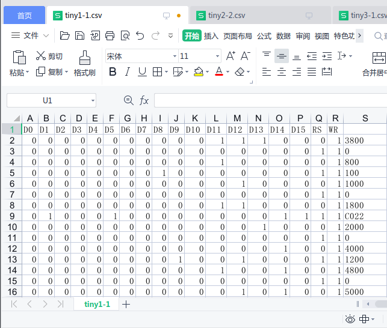

```
RS    DATA
0    3800
1    0
0    800
1    100
0    1000
1    0
0    1800
1    C022
0    2000
1    0
0    4000
1    1200
0    4800
1    0
0    5000
1    4000
0    6000
1    0
0    6800
1    0
0    7000
1    8020
0    7800
1    0
0    8000
1    0
0    8800
1    3800
0    9000
1    0
0    9800
1    0
0    8000
1    8720
0    8800
1    B920
0    9000
1    C1A0
0    9800
1    402
0    4820
1    4000
0    4020
1    6800
0    5020
1    80
0    20
1    78E0
0    820
1    0
0    8020
1    3F00
0    8820
1    3800
0    9020
1    1E00
0    9820
1    700
0    A020
1    1200
0    A820
1    1000
0    B020
1    7F03
0    B820
1    3F00
0    C020
1    0
0    C820
1    0
0    D020
1    3F00
0    D820
1    0
0    E020
1    3800
0    E820
1    0
0    8040
1    0
0    8840
1    78E0
0    9040
1    0
0    9840
1    F920
0    60
1    704
0    860
1    0
0    5060
1    0
0    80
1    0
0    880
1    0
0    1080
1    0
0    1880
1    0
0    2080
1    0
0    2880
1    0
0    8080
1    8000
0    9080
1    0
0    9880
1    1800
0    A880
1    8100
0    B880
1    0
0    C080
1    0
0    3800
1    820
0    3800
1    860
0    3800
1    9960
0    1800
1    4020
0    8040
1    0
0    8840
1    78E0
0    9040
1    0
0    9840
1    F920
0    20
1    78E0
0    820
1    0
0    1020
1    1020
```

## 0x14 参考链接

https://whycan.com/t_6647.html

https://github.com/steward-fu/fc3000

https://steward-fu.github.io/website/handheld/fc3000/lcd_init.htm

https://sigrok.org/wiki/PulseView
