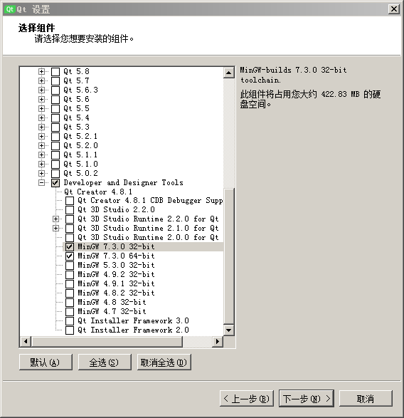
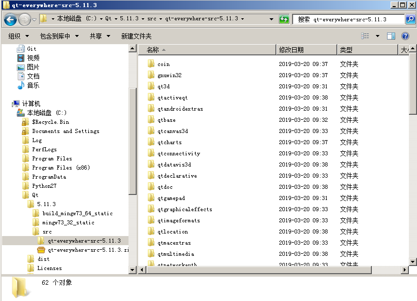
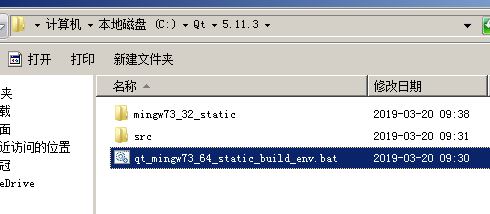
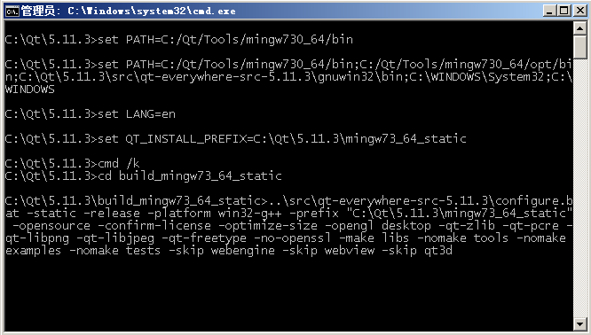
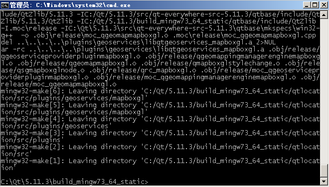
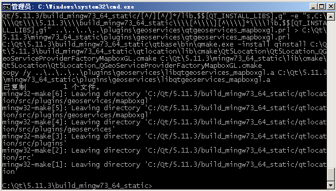

## 什么是静态链接版本

玩过 QT 的人都知道，QT 提供的版本都是动态链接。程序编译好之后需要带上一堆 QT 运行库的 DLL 才能正常启动。就算你在 `.pro` 文件增加了 `CONFIG += static` 静态编译选项，最终生成的 EXE 文件还是需要带上 QT 运行库。

静态链接版本就是为了解决生成的程序需要带上 QT 运行库的问题。以达到大幅减小程序发布时的体积。

## 授权问题

授权问题不在这里展开讨论，有兴趣可以问问度娘。这里只是简单说明一下：

1. 开源项目可以使用静态链接版本
2. 闭源项目使用静态链接版本需要做特殊处理

闭源项目需要做以下处理：

- 所有 QT 的调用都封装到 wapper 类，并且这些类需要开源
- 闭源代码通过上面封装的 wapper 类调用 QT ，这些代码不需要开源，但需要提供 .o 文件

无论是开源还是闭源项目，都需要在说明文件里说明使用了 QT 库并带上你使用的授权版本相应的授权文件。

## 编译工具

先去 QT 官网 https://www.qt.io/download 下载安装程序。

进入安装程序后，在“选择组件”界面选上 MinGW 编译工具。



我这里以 MinGW 7.3.0 为例，如需要，你可以安装其他版本。

为方便，我这里直接安装在默认路径 `C:\Qt` 目录下。

## 配置环境

## 目录结构

首先我们把目录结构创建好：

	C:\Qt
	  |- 5.11.3
	  |    |- build_mingw73_64_static # 编译目录
	  |    |- src # 存放 QT 源码
	  |- Tools # MinGW 工具安装目录

我选择了 `5.11.3` 版本做静态链接。`32bit` 版本我已经编译过了，本文编译 `64bit` 作为例子。如果你需要编译 `32bit` 版本，需要作相应修改，把所有 `mingw73_64` 改成 `mingw73_32` 。

## 下载源代码

把 https://download.qt.io/official_releases/qt/5.11/5.11.3/single/ 页面里的 ` qt-everywhere-src-5.11.3.zip` 文件下载到 `C:\Qt\5.11.3\src` 目录。


把源代码在 `C:\Qt\5.11.3\src` 目录解压。



_注意：zip 文件已经包含 `qt-everywhere-src-5.11.3` 目录，直接在 `src` 目录解压就可以了。_

## 配置脚本

把下面的脚本保存到 `C:\Qt\5.11.3\qt_mingw73_64_static_build_env.bat` 路径。

```bash
set PATH=C:/Qt/Tools/mingw730_64/bin;C:/Qt/Tools/mingw730_64/opt/bin;C:\Qt\5.11.3\src\qt-everywhere-src-5.11.3\gnuwin32\bin;C:\WINDOWS\System32;C:\WINDOWS
set LANG=en
set QT_INSTALL_PREFIX=C:\Qt\5.11.3\mingw73_64_static
cmd /k
```



后面双击这个脚本就可以编译 QT 源代码。

## configure.bat 脚本

编译 QT 源代码的参数都是通过这个脚本进行配置。

_例如：`动态链接` 还是 `静态链接`，编译哪些组件等等。_

详细参数可以参考 `configure.bat --help`

我这里使用以下命令配置 QT 源代码：
```bash
configure.bat -static -release -platform win32-g++ -prefix "C:\Qt\5.11.3\mingw73_64_static" -opensource -confirm-license -optimize-size -opengl desktop -qt-zlib -qt-pcre -qt-libpng -qt-libjpeg -qt-freetype -no-openssl -make libs -nomake tools -nomake examples -nomake tests -skip webengine -skip webview -skip qt3d
```

介绍一下几个重要参数：
`-static` 编译静态链接版本
`-release` 编译 release 版本，不带调试信息
`-platform win32-g++` 编译平台
`-prefix "C:\Qt\5.11.3\mingw73_64_static"` 编译完成后的安装目录
`-opensource` 编译开源版本
`-confirm-license` 自动接受授权协议
`-optimize-size` 编译优化文件大小
`-opengl desktop` 指定 OpenGL API
`-qt-*` 表示特别指定编译哪些模块
`-skip *` 表示不编译哪些模块
`-make *` 和 `-nomake *` 作用上上面类似

## 编译

## 配置 QT 源代码

双击上面准备好的 `qt_mingw73_64_static_build_env.bat` 脚本。

输入命令：
```bash
cd build_mingw73_64_static
..\src\qt-everywhere-src-5.11.3\configure.bat -static -release -platform win32-g++ -prefix "C:\Qt\5.11.3\mingw73_64_static" -opensource -confirm-license -optimize-size -opengl desktop -qt-zlib -qt-pcre -qt-libpng -qt-libjpeg -qt-freetype -no-openssl -make libs -nomake tools -nomake examples -nomake tests -skip webengine -skip webview -skip qt3d
```



_注意：这里一定要在一个空的目录里以 `C:\path\to\configure.bat` 的方式调用 `configure.bat` 脚本。_

在这里我踩过坑：之前直接在 QT 源代码目录（`C:\Qt\5.11.3\src\qt-everywhere-src-5.11.3`）里执行 `configure.bat` 脚本，到编译的时候会报一系列错误。

配置完成，脚本会显示一份报告。并且告诉你运行 `mingw32-make` 开始编译，编译完成后支持 `mingw32-make install` 把编译好的库文件安装到 `C:\Qt\5.11.3\mingw73_64_static`。

```
Configure summary:

Build type: win32-g++ (x86_64, CPU features: cx16 mmx sse sse2 sse3)
Configuration: sse2 aesni sse3 ssse3 sse4_1 sse4_2 avx avx2 avx512f avx512bw avx
512cd avx512dq avx512er avx512ifma avx512pf avx512vbmi avx512vl compile_examples
 f16c largefile optimize_size precompile_header rdrnd shani x86SimdAlways releas
e c++11 c++14 c++1z concurrent dbus no-pkg-config static stl
Build options:
  Mode ................................... release
  Optimize release build for size ........ yes
  Building shared libraries .............. no

...

Note: Using static linking will disable the use of dynamically
loaded plugins. Make sure to import all needed static plugins,
or compile needed modules into the library.

Note: No wayland-egl support detected. Cross-toolkit compatibility disabled.

Qt is now configured for building. Just run 'mingw32-make'.
Once everything is built, you must run 'mingw32-make install'.
Qt will be installed into 'C:\Qt\5.11.3\mingw73_64_static'.

Prior to reconfiguration, make sure you remove any leftovers from
the previous build.
```

## 编译

输入 `mingw32-make -j5` 开始编译，`-j5` 是使用多任务并行编译，一般是 CPU 核心数加 1 。我这里是 4 核心，因此使用 `-j5` 参数。

接着就是等着编译完成了，你可以去喝喝咖啡或者做做别的再回来。

编译时长根据机器配置、编译的模块不同确定。我这里大概 30 分钟编译好。

没有错误的话，编译完成大概是下图这个样子：



## 安装 QT 库

最后输入 `mingw32-make -j5 install` 命令就会把编译好的库都安装到 `C:\Qt\5.11.3\mingw73_64_static` 下了。

安装完成大概如下图：



## 命令行编译环境

最后，我写了一个脚本，以便使用新编译好的 QT 库进行编译。

```bash
@echo off
echo Setting up environment for Qt usage...
set PATH=C:\Qt\5.11.3\mingw73_64_static\bin;C:/Qt/Tools/mingw730_64\bin;C:\WINDOWS
\System32;C:\WINDOWS
cmd /k
```

我习惯把它放到 `C:\Qt\5.11.3` 目录，双击它就可以使用新编译好的 QT 库。

例如：

```bash
cd /d D:\test
qmake test.pro
mingw32-make -j5
```

这样就可以使用最新编译好的 QT 库编译 `test.pro` 工程。

到此，你的静态链接版本 QT 库已经可以正常使用了。

## 配置 Qt Creator

限于篇幅，配置 Qt Creator 使用新编译的 QT 库另开一章详细介绍。
